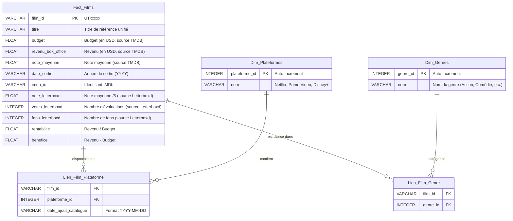

# Pipeline ETL - Valorisation de Catalogues Streaming (Netflix, Disney+, Prime Video)

Ce projet est un pipeline ETL (Extraction, Transformation, Load) complet et automatisé en Python permettant de centraliser, dédupliquer par Fuzzy Matching, enrichir via les APIs/Scraping (TMDB & Letterboxd), et modéliser de façon relationnelle les catalogues de films et séries de Netflix, Disney+ et Amazon Prime Video.

---

## 1. Architecture de la Base de Données

Le modèle suit un **Schéma en Étoile** optimisé pour l'analyse décisionnelle (Data Warehousing). La base de données relationnelle est gérée sous **SQLite** (`data/processed/pipeline_etl.db`).

### Diagramme Entité-Association (Mermaid ERD)



---

## 2. Dictionnaire de Données

### Table de Faits : `Fact_Films`
Cette table stocke les métadonnées unifiées et enrichies de chaque film/série.

| Nom de Colonne | Type SQL | Clé | Description |
| :--- | :--- | :---: | :--- |
| `film_id` | `TEXT` | **PK** | Identifiant unique unifié généré (ex: `UT00001`). |
| `titre` | `TEXT` | | Titre de référence après résolution. |
| `budget` | `REAL` | | Budget de production du film en USD (remplace 0 par `NULL`). |
| `revenu_box_office` | `REAL` | | Revenus générés au box-office en USD (remplace 0 par `NULL`). |
| `note_moyenne` | `REAL` | | Note moyenne des utilisateurs TMDB (sur 10). |
| `date_sortie` | `TEXT` | | Année de sortie (format `YYYY`). |
| `imdb_id` | `TEXT` | | Jeton IMDb officiel (ex: `tt11394180`). |
| `note_letterboxd` | `REAL` | | Note moyenne sur Letterboxd (sur 5). |
| `votes_letterboxd` | `INTEGER` | | Nombre de votes sur la plateforme Letterboxd. |
| `fans_letterboxd` | `INTEGER` | | Nombre de fans ayant le film dans leurs favoris Letterboxd. |
| `rentabilite` | `REAL` | | Calculé : `revenu_box_office / budget` (indicateur de performance). |
| `benefice` | `REAL` | | Calculé : `revenu_box_office - budget`. |

### Table de Dimension : `Dim_Plateformes`
Répertoire des plateformes de streaming.

| Nom de Colonne | Type SQL | Clé | Description |
| :--- | :--- | :---: | :--- |
| `plateforme_id` | `INTEGER` | **PK** | Identifiant technique auto-incrémenté. |
| `nom` | `TEXT` | | Nom unique de la plateforme (`Netflix`, `Prime Video`, `Disney+`). |

### Table de Dimension : `Dim_Genres`
Répertoire des genres cinéphiles unifiés (plateformes + TMDB).

| Nom de Colonne | Type SQL | Clé | Description |
| :--- | :--- | :---: | :--- |
| `genre_id` | `INTEGER` | **PK** | Identifiant technique auto-incrémenté. |
| `nom` | `TEXT` | | Nom unique du genre (ex: `Action`, `Animation`, `Drama`, etc.). |

### Table de Liaison : `Lien_Film_Plateforme`
Liaison many-to-many entre films et plateformes d'accueil.

| Nom de Colonne | Type SQL | Clé | Description |
| :--- | :--- | :---: | :--- |
| `film_id` | `TEXT` | **FK** | Clé étrangère pointant vers `Fact_Films(film_id)`. |
| `plateforme_id` | `INTEGER` | **FK** | Clé étrangère pointant vers `Dim_Plateformes(plateforme_id)`. |
| `date_ajout_catalogue` | `TEXT` | | Date de mise à disposition sur la plateforme (format `YYYY-MM-DD`). |

### Table de Liaison : `Lien_Film_Genre`
Liaison many-to-many reliant les films à leurs différents genres.

| Nom de Colonne | Type SQL | Clé | Description |
| :--- | :--- | :---: | :--- |
| `film_id` | `TEXT` | **FK** | Clé étrangère pointant vers `Fact_Films(film_id)`. |
| `genre_id` | `INTEGER` | **FK** | Clé étrangère pointant vers `Dim_Genres(genre_id)`. |

---

## 3. Installation et Configuration

### Prérequis
- Python 3.10+
- Un compte TMDB (pour obtenir une clé d'API si vous souhaitez lancer une extraction complète)

### Installation
1. Activez ou créez l'environnement virtuel à la racine du projet :
   ```powershell
   python -m venv .venv
   .venv\Scripts\activate  # Sous Windows (PowerShell)
   source .venv/bin/activate  # Sous Linux/macOS
   ```
2. Installez toutes les dépendances :
   ```powershell
   pip install -r requirements.txt
   ```
3. Configurez vos variables d'environnement en dupliquant le fichier d'exemple :
   - Dupliquez `.env.example` et renommez-le en `.env`.
   - Modifiez-le pour y ajouter vos identifiants TMDB :
     ```dotenv
     TMDB_READ_TOKEN=votre_jeton_d_accès_bearer_ici
     TMDB_API_KEY=votre_clé_api_ici
     ```

---

## 4. Utilisation du Pipeline (Orchestration)

Le projet intègre un orchestrateur principal [main.py](file:///C:/Users/Gambey/Documents/GitHub/pipeline-etl/main.py) qui permet de lancer le pipeline de bout en bout avec une seule commande.

### 1. Mode Démo (Recommandé pour tester)
Ce mode lance le pipeline complet mais restreint les appels d'API externes (5 appels TMDB et 3 appels Letterboxd) afin de valider le fonctionnement instantanément :
```powershell
python main.py --demo
```

### 2. Mode Complet
Pour lancer le pipeline complet sur l'intégralité des catalogues (19 713 titres uniques) :
```powershell
python main.py --all
```

### 3. Options avancées
Vous pouvez ignorer certaines étapes :
```powershell
python main.py --skip-extract  # Utilise les caches existants sans appeler les API/Scrapers
```

### 4. Lancement du Dashboard de Supervision et Visualisation
L'interface Web interactive peut être lancée de deux manières :
- **À la suite du pipeline** en ajoutant l'argument `--serve` :
  ```powershell
  python main.py --skip-extract --serve
  ```
- **Directement et de façon indépendante** en lançant le script Flask :
  ```powershell
  python app.py
  ```
Une fois le serveur démarré, ouvrez votre navigateur à l'adresse suivante : **http://127.0.0.1:5000**

---

## 5. Requêtes SQL Complexes de Validation

Voici 3 requêtes d'analyse décisionnelle complexes utilisables sur la base SQL unifiée :

### Requête 1 : Quelle plateforme possède le plus de films rentables au box-office ?
```sql
SELECT p.nom AS plateforme, COUNT(f.film_id) AS nb_films_rentables
FROM Fact_Films f
JOIN Lien_Film_Plateforme l ON f.film_id = l.film_id
JOIN Dim_Plateformes p ON l.plateforme_id = p.plateforme_id
WHERE f.benefice > 0
GROUP BY p.nom
ORDER BY nb_films_rentables DESC;
```
*Exemple de sortie (Démonstration) :*
```text
plateforme | nb_films_rentables
-----------|-------------------
Netflix    | 1
```

### Requête 2 : Quels sont les genres les mieux notés en moyenne (TMDB vs Letterboxd) ?
```sql
SELECT g.nom AS genre, 
       ROUND(AVG(f.note_moyenne), 2) AS moyenne_tmdb_sur_10,
       ROUND(AVG(f.note_letterboxd * 2), 2) AS moyenne_letterboxd_sur_10,
       COUNT(f.film_id) AS nombre_films
FROM Fact_Films f
JOIN Lien_Film_Genre lg ON f.film_id = lg.film_id
JOIN Dim_Genres g ON lg.genre_id = g.genre_id
WHERE f.note_moyenne IS NOT NULL AND f.note_letterboxd IS NOT NULL
GROUP BY g.nom
ORDER BY moyenne_letterboxd_sur_10 DESC;
```

### Requête 3 : Quels films sont présents sur plus d'une plateforme (co-exclusivités) et leur note moyenne ?
```sql
SELECT f.titre, 
       f.date_sortie AS annee, 
       f.note_moyenne AS note_tmdb, 
       COUNT(l.plateforme_id) AS nombre_plateformes,
       GROUP_CONCAT(p.nom, ', ') AS plateformes
FROM Fact_Films f
JOIN Lien_Film_Plateforme l ON f.film_id = l.film_id
JOIN Dim_Plateformes p ON l.plateforme_id = p.plateforme_id
GROUP BY f.film_id, f.titre, f.date_sortie, f.note_moyenne
HAVING nombre_plateformes > 1
ORDER BY nombre_plateformes DESC, f.note_moyenne DESC
LIMIT 5;
```
*Exemple de sortie (Démonstration) :*
```text
titre             | annee | note_tmdb | nombre_plateformes | plateformes
------------------|-------|-----------|--------------------|------------------------
True Grit         | 2010  | NULL      | 2                  | Netflix, Prime Video
The Golden Child  | 1986  | NULL      | 2                  | Netflix, Prime Video
```
